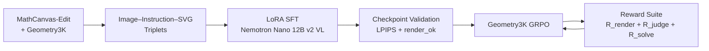

# RedPen VLM

**Creating Interpretable SVG Synthesis VLM**

> NeMotron Hackathon · Seoul · 2026
> Team **pkill nvidia-smi** — Kim Yoonsik, Song Kayeon, Park Chanwoo, Jung Jiyu

RedPen VLM is a vision-language model that **draws interpretable auxiliary lines** on geometry problems. Instead of describing a construction in prose, the model emits structured SVG that can be parsed, rendered, and scored — turning "add a helper line" into a measurable generation task.

---

## The Problem

Even Gemini 3 Pro can't ground what it sees.

When asked to locate a specific object in a crowded image (e.g. "find tangerine #57"), state-of-the-art VLMs produce plausible-sounding but spatially incorrect answers. They reason *about* the image without anchoring that reasoning to real pixel coordinates.

Geometry problem solving is an extreme case of this. Human solvers routinely draw auxiliary lines, mark points, and trisect angles — constructions that don't exist in the original diagram but make the problem tractable. Most VLMs can't.

---

## The Goal

A VLM that produces auxiliary constructions with three properties:

| Property          | Meaning                                                                 |
| ----------------- | ----------------------------------------------------------------------- |
| **Interpretable** | Every stroke is a parseable SVG element with real coordinates.          |
| **Grounded**      | The drawn line is the same object the reasoning refers to.              |
| **Useful**        | Adding the auxiliary line improves the solve — ΔG2U > 0.                |

The core idea is to make auxiliary construction a **generation problem whose output is simultaneously text (SVG) and image (rendered result)** — so it can be supervised, judged, and RL-optimized.

```text
Geometry problem image + instruction
        ↓
VLM generates SVG auxiliary construction
        ↓
SVG is rendered back into an image
        ↓
Solver/judge re-evaluates the problem with the augmented diagram
```

---

## Training Overview

| Component     | Choice                                                                                     |
| ------------- | ------------------------------------------------------------------------------------------ |
| **Framework** | NeMo-RL                                                                                    |
| **Model**     | NVIDIA-Nemotron-Nano-12B-v2-VL-BF16                                                        |
| **SFT data**  | MathCanvas-Edit *Foundational Structure Generation* subset (~1M) + Geometry3K              |
| **RL data**   | Geometry3K (train, 2.1K)                                                                   |

Two-stage pipeline:



---

## Stage 1 — SFT: Image–Instruction–SVG Triplets

Each MathCanvas-Edit transition becomes a supervised editing sample:

```text
Input (image)       : current partial diagram
Input (instruction) : "Construct points C and D such that ABCD is a square."
Output (SVG)        : next-step diagram with the new construction encoded as SVG
```

The SVG target uses semantic groups so base geometry and new constructions are separable:

```xml
<svg viewBox="0 0 300 220">
  <g id="base" stroke="black">                              <!-- existing geometry -->
    <line x1="70" y1="150" x2="230" y2="150"/>
    <circle cx="70"  cy="150"/>                             <!-- A -->
    <circle cx="230" cy="150"/>                             <!-- B -->
  </g>
  <g id="edit" stroke="red" stroke-dasharray="5.5,2.4">     <!-- new construction -->
    <line/> <line/> <line/>                                 <!-- AD, DC, CB -->
    <circle/> <circle/>                                     <!-- new points C, D -->
  </g>
</svg>
```

Visual convention: existing geometry in **black solid**, new construction in **red dashed** — hence *RedPen*.

### Primitive-level diff

New elements between consecutive steps are detected by set difference over point-name keys, not object identity:

```text
Point   = point name
Line    = frozenset(point names)
Circle  = frozenset(point names)
Segment = frozenset(point names)
```

This avoids false positives from graph rebuilds.

### What broke, and what we shipped

SFT on NeMo-RL for a VLM turned into a practical PEFT case study:

| Issue                                                                 | Fix                                                     |
| --------------------------------------------------------------------- | ------------------------------------------------------- |
| Training collapse (loss diverges or plateaus high)                    | Tuned LR, disabled LM-head LoRA, disabled vision-encoder LoRA |
| Data mixture weighting, vision-encoder grad checkpointing, metric log | Code patches against NeMo-RL                            |

The second training curve in the deck — the one that actually descends smoothly from 11.8 → 0 — is the run we used for the results below.

---

## Stage 2 — RL: Rewards from Rendered Images

For each Geometry3K problem, the policy produces 4 SVG candidates. Each candidate is rendered, then scored on three axes:

### `R_render` — does it render?

```text
1 if the SVG parses and renders
0 otherwise
```

Cheap, but critical: early RL collapses the moment candidates stop rendering.

### `R_judge` — is it geometrically helpful?

A judge model ranks the 4 candidates per problem on a 0–3 ordinal scale (3 = most helpful, 0 = least).

```text
Judge model: Qwen 3.5 110B-A10B (served via OpenRouter)
```

### `R_solve` — does it actually help solve the problem?

A lightweight solver (Qwen 3.5 VL 9B) attempts each problem **twice** — once with the original figure, once with the auxiliary line overlaid:

| Outcome                                   | Score |
| ----------------------------------------- | ----- |
| Fails without aux, succeeds with aux      | **2** |
| Same result either way                    | **1** |
| Succeeds without aux, fails with aux      | **0** |

### Aggregate

```text
Loss  =  R_render  +  R_judge  +  R_solve
```

---

## Results

### SFT — geometric structure emerges

**Result 1** — *Let ABC be an equilateral triangle. Construct point F by rotating D 90° clockwise around B.*
The prediction correctly places F outside the triangle via a red dashed segment from the B-side vertex, matching the GT construction direction.

**Result 2** — *Let ABC be a right triangle with right angle at A. Construct D, E on AC such that BD, BE trisect angle ABC.*
Prediction draws two red dashed cevians from the apex down to two interior points on the base — the trisection structure is correct, though with a different base orientation than the GT.

### SFT — quantitative progression

LPIPS against GT rendering, n=32 on `train_00500.jsonl`, greedy decoding, alex@512:

| Step | LPIPS (all) | LPIPS (render_ok only) | render_ok rate    |
| ---- | ----------- | ---------------------- | ----------------- |
| 10   | 0.5300      | 0.4628                 | 28/32 (87.5%)     |
| 20   | **0.4846**  | **0.4503**             | 30/32 (93.8%)     |
| 30   | 0.5579      | 0.4760                 | 27/32 (84.4%)     |
| 40   | 0.4883      | 0.4718                 | **31/32 (96.9%)** |

Key observation: **loss and LPIPS are not monotonically aligned** with checkpoint step. Step 30 has the lowest render_ok rate despite being later in training. This is why we validate every checkpoint with render + LPIPS probes, not loss alone.

### Geometry3K inference baseline

Measured on `hiyouga/geometry3k` train `[0:50]` using the original problem images (no aux lines yet):

```text
Total samples:                     50
Valid predictions:                 46
Correct:                           31
API errors:                         4
Accuracy over all samples:       62.0%
Accuracy over valid predictions: 67.4%
Valid answer rate:               92.0%
```

This is the baseline ΔG2U is measured against.
