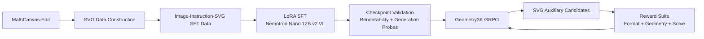

# VUVLM: Geometry-Aware SVG Auxiliary Construction

**VUVLM** is a research prototype for training vision-language models to generate **SVG-based auxiliary constructions** for geometry problem solving.

The project investigates whether a multimodal model can learn to add useful geometric constructions — auxiliary lines, points, and circles — in a structured SVG format. The generated SVG is rendered back into an image and used to improve downstream geometry reasoning.

The system is organized into three stages:

1. **SVG data construction** from MathCanvas-Edit trajectories
2. **Cold-start SFT** for image-instruction-to-SVG generation
3. **Geometry-aware GRPO** using format, geometry, and solving rewards

---

## Motivation

Geometry problems often require auxiliary constructions that are not present in the original diagram. Humans routinely solve such problems by drawing additional lines, points, or circles, but most VLMs only reason over the given image and text — they do not explicitly modify the diagram.

This project treats auxiliary construction as a generation problem:

```text
Geometry problem image + instruction
        ↓
VLM generates SVG auxiliary construction
        ↓
SVG is rendered back into an image
        ↓
Model or judge re-solves the problem with the augmented diagram
```

The core idea is to make the construction **interpretable, renderable, and rewardable** by representing it as SVG.

---

## Project Overview



---

## Repository Layout

```text
vuvlm/
├── inference/
│   └── async_eval_geometry3k_friendli.py
│
├── sft-data/
│   ├── MathCanvas/
│   ├── make_sft_1k_llava.py
│   ├── make_sft_10k.py
│   ├── make_sft_100k.py
│   ├── render_variants_v2.py
│   ├── emit_semantic.py
│   ├── canonical_svg.py
│   └── sft_llava_1k/
│
├── nemo-RL-v0.5.0/
│   ├── examples/
│   ├── hackaton/
│   ├── tools/
│   ├── results/
│   ├── logs/
│   ├── run_real.sh
│   ├── run_rl.sh
│   ├── run_rl_base.sh
│   └── run_rl_smoke.sh
│
└── docker-compose.yml
```

---

## Setup

Clone the repository and set `PROJECT_ROOT` to point at the project directory. All commands below assume this variable is defined.

```bash
git clone <repo-url> vuvlm
cd vuvlm
export PROJECT_ROOT=$(pwd)
```

Add the export to your shell profile (`~/.bashrc`, `~/.zshrc`) to persist it across sessions.

---

## Key Design Choices

### 1. Tractable Image–Instruction–SVG Triplets

Each MathCanvas-Edit transition is converted into a supervised editing sample:

```text
code_list[i] + instruction_list[i] → code_list[i+1]
```

which maps to:

```text
Image       = clean render of the current diagram
Instruction = natural-language geometric edit
SVG         = semantic SVG of the next construction step
```

Example:

```text
Input Image:   current partial diagram
Instruction:   "Construct points C and D such that ABCD is a square."
Target SVG:    next-step diagram with the new construction encoded as SVG
```

---

### 2. Semantic SVG Targets

The target is not a raw Matplotlib SVG blob — it is emitted as a structured SVG with separate semantic groups:

```xml
<svg>
  <desc>
    DDAR construction program / metadata
  </desc>

  <g id="base">
    <!-- existing geometry -->
  </g>

  <g id="edit">
    <!-- newly added construction -->
  </g>

  <g id="labels">
    <!-- point labels -->
  </g>
</svg>
```

Visual convention:

| Element type                   | Style                     |
| ------------------------------ | ------------------------- |
| Existing geometry              | black solid stroke        |
| New construction lines/circles | red dashed stroke         |
| Existing points                | black points              |
| New points                     | red points or red markers |

This structure makes generated outputs easier to parse, render, inspect, and score.

---

### 3. Primitive-Level Diff

To identify newly added elements, the pipeline compares consecutive graph states:

```text
prev_keys = primitives(step_i)
curr_keys = primitives(step_i+1)
new_keys  = curr_keys - prev_keys
```

Primitive keys are defined by point names rather than object identity, so that graph rebuilds and object-address changes do not produce false positives:

```text
Point   = point name
Line    = frozenset(point names)
Circle  = frozenset(point names)
Segment = frozenset(point names)
```

---

### 4. Cold-Start SVG SFT

Before applying RL, the model is trained on supervised data so that it can produce valid SVG-like outputs.

```text
Input  : partially drawn geometry image + edit instruction
Output : semantic SVG target
```

This stage reduces:

* invalid SVG outputs
* render failures
* unstructured token generation
* reward collapse in early RL

---

### 5. Geometry-Aware GRPO

In the RL stage, the model generates multiple SVG auxiliary construction candidates per Geometry3K problem. Candidates within each group are compared under a three-layer reward suite:

```text
R_format      : SVG extraction / parsing / rendering validity
R_geometry    : judge-based geometric quality
R_solve_aux   : whether the augmented diagram helps solve the problem
```

---

## Data Construction

### Source Dataset

SFT data is built from **MathCanvas-Edit**, specifically the `foundational_structure_generation` subset. Each row contains a step-wise construction trajectory:

```text
id
seed
base_caption
code_list
instruction_list
image_list
```

The key transition is `code_list[i] + instruction_list[i] → code_list[i+1]`.

---

### Renderer Choice

The pipeline uses the original MathCanvas `foundations_synthesis` renderer rather than newclid, because:

* MathCanvas and newclid use different construction dialects.
* newclid renders with visually incompatible styles.
* Primitive extraction differs between the two and may fail to reproduce the original diagram.
* The MathCanvas renderer preserves the dataset's labels, layout, line styles, and right-angle marks.

---

### Generating LLaVA-Style SVG SFT Data

```bash
cd $PROJECT_ROOT/sft-data

python make_sft_1k_llava.py
```

Output layout:

```text
sft_llava_1k/
├── train.json
├── train.jsonl
├── images/
├── preview/
│   ├── sample_000.json
│   ├── sample_000.png
│   └── sample_000_target.svg
└── failures.jsonl
```

Each training sample uses a LLaVA-style format:

```json
{
  "id": "source_id/edit_0",
  "image": "images/source_id_edit_0.png",
  "conversations": [
    {
      "from": "human",
      "value": "<image>\nYou are given a partially-drawn geometric diagram..."
    },
    {
      "from": "gpt",
      "value": "<svg>...</svg>"
    }
  ]
}
```

---

## Training

### Cold-Start SFT

SFT uses **Nemotron Nano 12B v2 VL** with **LoRA** on top of NeMo-RL v0.5.0.

Smoke-test configuration:

```text
Model:      Nemotron Nano 12B v2 VL
Framework:  NeMo-RL v0.5.0
Method:     LoRA SFT
LoRA dim:   8
Hardware:   1 × H100 PCIe
Smoke data: 200 samples
Steps:      20
```

Run:

```bash
cd $PROJECT_ROOT/nemo-RL-v0.5.0

uv run python examples/run_vlm_sft.py \
  --config examples/configs/sft_vlm_nemotron_nano_v2_llava_smoke.yaml
```

or simply:

```bash
./run_real.sh
```

---

### Checkpointing

LoRA checkpoints are saved periodically under:

```text
results/sft_nemotron_vl_lora/
├── step_10/
├── step_20/
└── step_30/
```

Each checkpoint contains:

```text
config.yaml
training_info.json
train_dataloader.pt
policy/
  weights/
  optimizer/
```

---

### LoRA Merge for Inference

NeMo-RL checkpoints are not directly loadable by standard Hugging Face inference. The LoRA adapter must be merged into the base model and exported as a HuggingFace-compatible checkpoint:

```bash
DT=/opt/ray_venvs/nemo_rl.models.policy.workers.dtensor_policy_worker_v2.DTensorPolicyWorkerV2

$DT/bin/python tools/inference/merge_lora_nemotron_vl.py \
  --adapter-dir results/sft_nemotron_vl_lora/step_10/policy/weights/model \
  --out-dir results/sft_nemotron_vl_lora/step_10_merged \
  --device cuda:0
```

Merged output:

```text
step_10_merged/
├── config.json
├── model-00001-of-00006.safetensors
├── ...
├── model.safetensors.index.json
├── tokenizer.json
└── processor_config.json
```

---

## Geometry3K Inference Baseline

The inference script evaluates a VLM on Geometry3K using original problem images:

```bash
cd $PROJECT_ROOT/inference

python async_eval_geometry3k_friendli.py \
  --dataset hiyouga/geometry3k \
  --split train \
  --limit 50 \
  --mode original \
  --concurrency 2 \
  --max-retries 2 \
  --max-tokens 2048 \
  --out results_original_50.jsonl
```

Observed baseline on `hiyouga/geometry3k` train `[0:50]`:

```text
Total samples:                  50
Valid predictions:              46
Correct:                        31
API errors:                     4
Accuracy over all samples:      62.0%
Accuracy over valid predictions:67.4%
Valid answer rate:              92.0%
```

Input format:

```text
Image:    row["images"][0]
Question: row["problem"]
Answer:   row["answer"]
```

---

## GRPO / RL

### Objective

The RL stage prompts the model to generate SVG auxiliary constructions for Geometry3K problems:

```text
Input:  Geometry problem image + text prompt
Output: SVG auxiliary construction
```

The SVG is rendered and evaluated under the reward suite.

---

### Run Scripts

| Script             | Purpose             |
| ------------------ | ------------------- |
| `run_rl.sh`        | Warm-started run    |
| `run_rl_base.sh`   | Base-model run      |
| `run_rl_smoke.sh`  | Smoke test          |

GRPO configuration:

```text
num_prompts_per_step       = 3
num_generations_per_prompt = 4
rollouts per step          = 12
train_global_batch_size    = 12
GPUs                       = 6
parallelism                = pure DP
```

---

### Reward Components

```text
1. Format reward
   - Can the SVG be extracted?
   - Can it be parsed?
   - Can it be rendered?

2. Geometry / judge reward
   - Are the added constructions geometrically meaningful?
   - Are they aligned with the problem?

3. Solve-after-aux reward
   - Does the augmented diagram improve solving accuracy?
```

---

## Hardware Notes

The training node uses 8 × H100 PCIe GPUs, but intra-node topology is constrained:

```text
NVLink pairs:
  GPU 0-1
  GPU 2-3
  GPU 4-5
  GPU 6-7

Cross-pair communication:
  PCIe / PHB
```

Large TP/PP configurations across all 8 GPUs are therefore suboptimal. The project uses conservative settings:

* single-GPU LoRA SFT for smoke validation
* TP=2 only within an NVLink pair for vLLM inference
* pure DP for GRPO where possible
* NCCL flags to avoid unsupported P2P paths

Example environment flags:

```bash
NCCL_P2P_DISABLE=1
NCCL_SHM_DISABLE=1
NCCL_DEBUG=WARN
PYTORCH_ALLOC_CONF=expandable_segments:True
```

---

## Quick Start

### 1. Build SVG SFT data

```bash
cd $PROJECT_ROOT/sft-data
python make_sft_1k_llava.py
```

Preview samples:

```bash
open sft_llava_1k/preview/sample_000.png
open sft_llava_1k/preview/sample_000_target.svg
cat sft_llava_1k/preview/sample_000.json
```

---

### 2. Run SFT smoke training

```bash
cd $PROJECT_ROOT/nemo-RL-v0.5.0
./run_real.sh
```

Monitor:

```bash
tail -F logs/*.log | grep -E "Step |Validation|Error|Killed"
```

---

### 3. Run Geometry3K inference baseline

```bash
cd $PROJECT_ROOT/inference

python async_eval_geometry3k_friendli.py \
  --dataset hiyouga/geometry3k \
  --split train \
  --limit 50 \
  --mode original \
  --concurrency 2 \
  --max-retries 2 \
  --max-tokens 2048 \
  --out results_original_50.jsonl
```

---

### 4. Run GRPO smoke test

```bash
cd $PROJECT_ROOT/nemo-RL-v0.5.0
./run_rl_smoke.sh
```

---

## Environment Variables

For Friendli inference:

```bash
FRIENDLI_API_KEY=...
FRIENDLI_BASE_URL=https://api.friendli.ai/dedicated/v1
FRIENDLI_MODEL=...
```

For judge-based reward / OpenRouter:

```bash
OPENROUTER_API_KEY=...
```

Do not commit `.env` files:

```gitignore
.env
*.env
```


---

## Acknowledgements

This project builds on:

* NVIDIA NeMo-RL
* NVIDIA Nemotron Nano VL
* MathCanvas / MathCanvas-Edit
* Geometry3K
* LLaVA-style multimodal instruction tuning
* vLLM and OpenAI-compatible inference APIs
